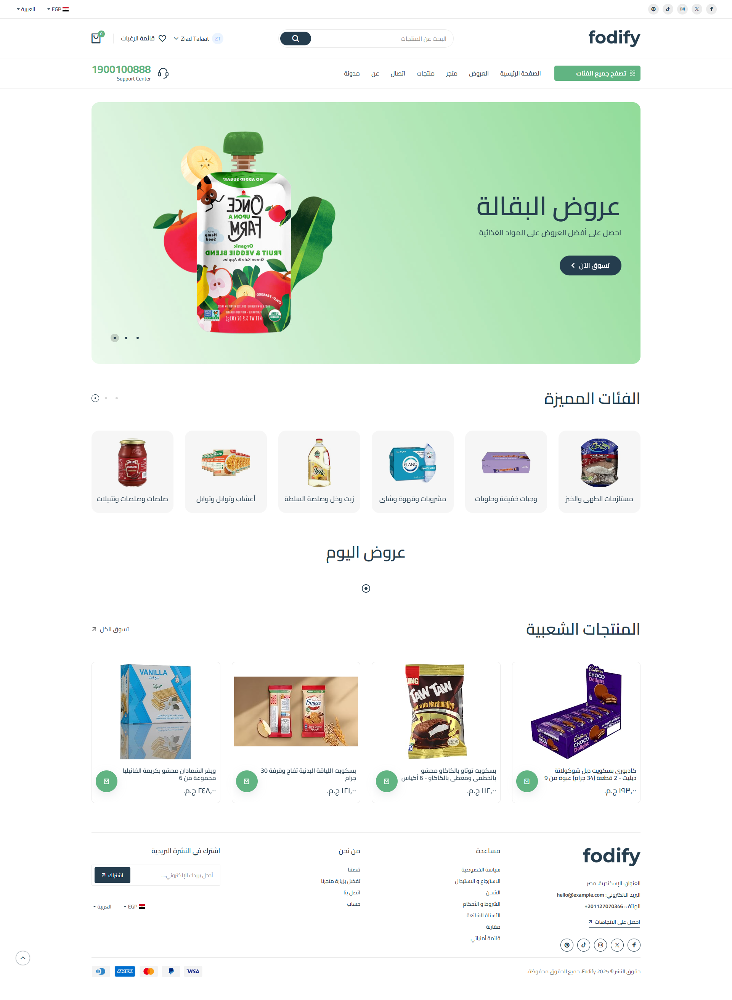
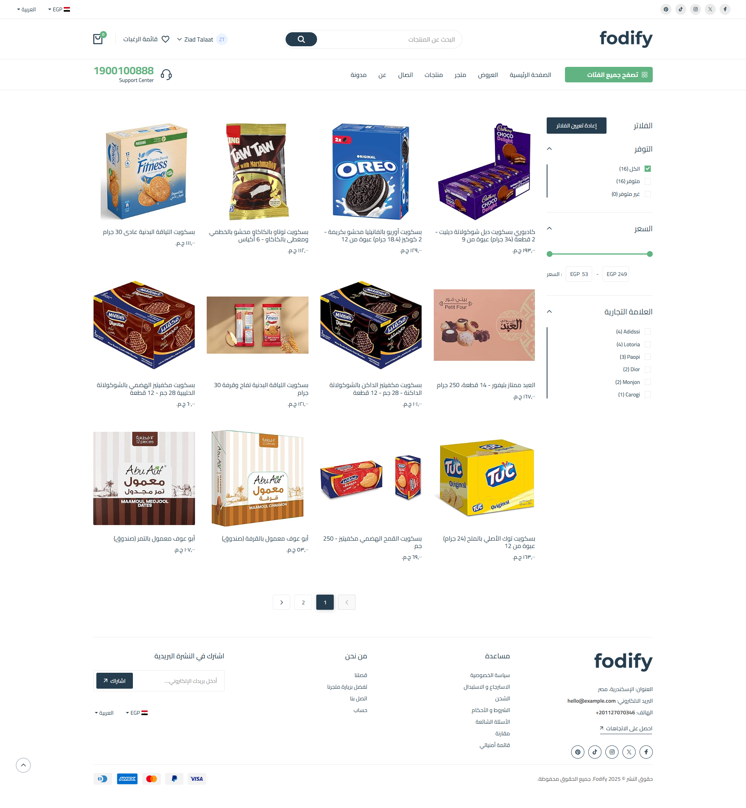
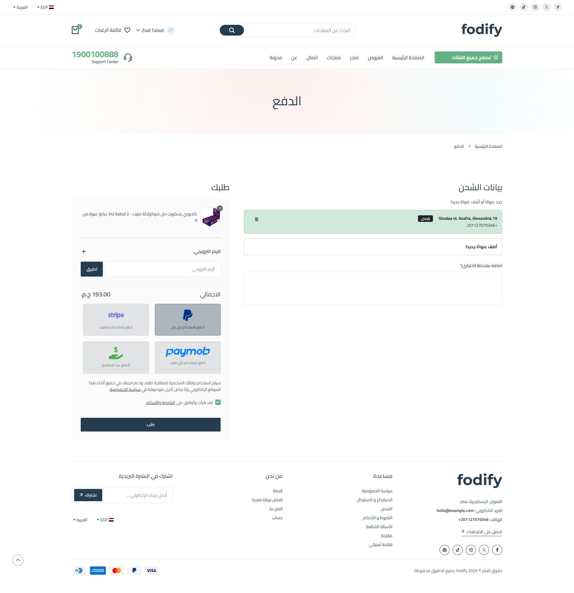
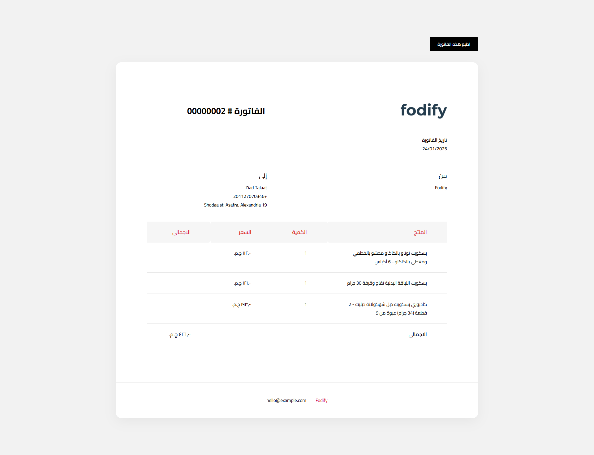
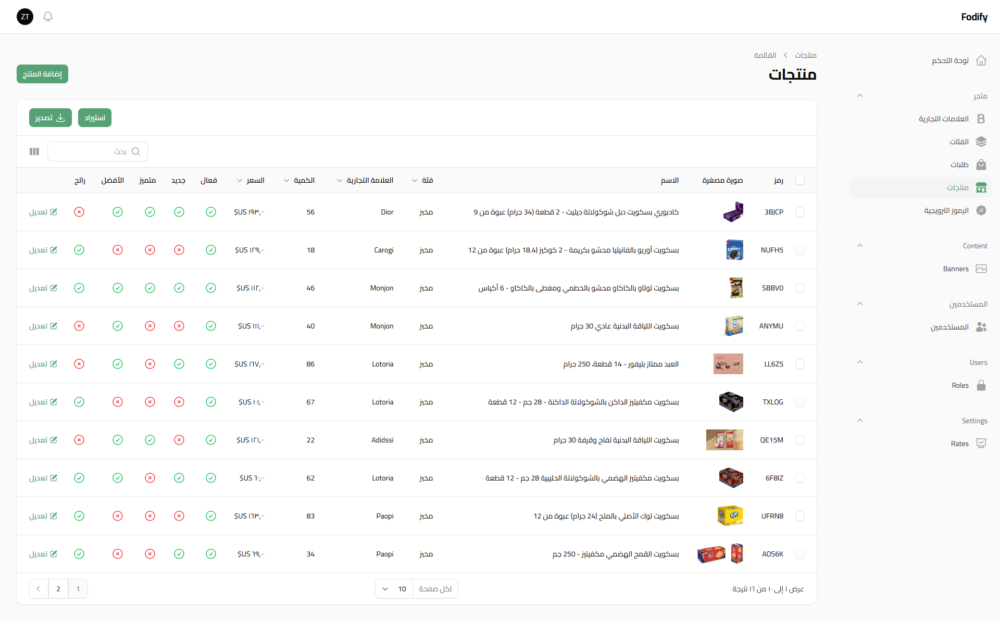
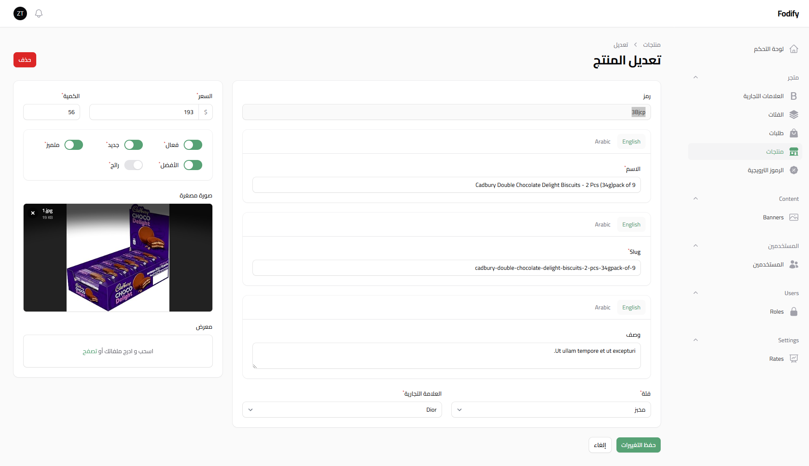
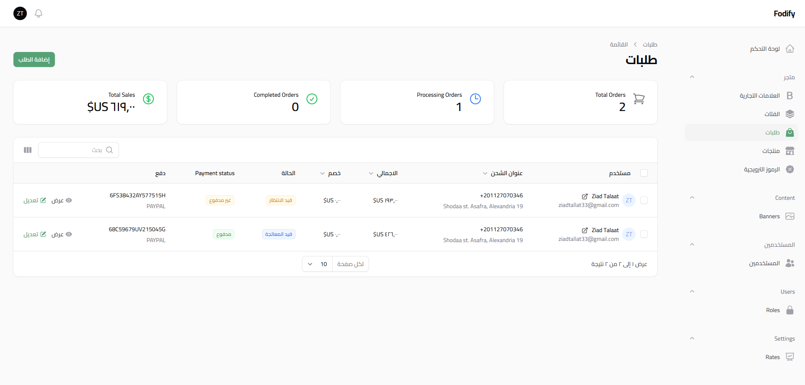
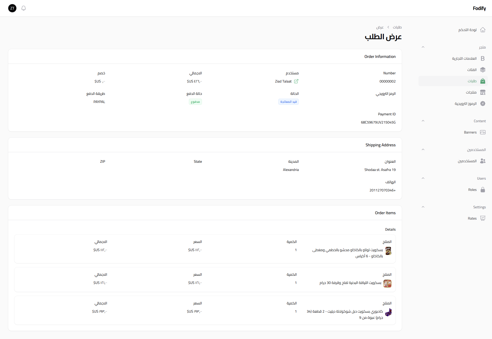

<p align="center"></p>

<p align="center" style="margin-top: 20px;">
    <a href=""></a>
    <a href=""></a>
</p>

# Fodify

Fodify is an ecommerce platform focused on food delivery, built with Tailwind CSS, Livewire, and Laravel.

## Features

- **User Authentication**: Register, login, and password reset functionality.
- **User Profile Management**: Update profile information and change password.
- **Product Management**: Add, edit, and delete products.
- **Category Management**: Add, edit, and delete categories.
- **Wishlist**: Add products to the wishlist.
- **Cart**: Add products to the cart and proceed to checkout.
- **Order Management**: Place orders and view order history.
- **Address Management**: Add, edit, and delete addresses.
- **Newsletter Subscription**: Subscribe to the newsletter.
- **Banner Management**: Display promotional banners.
- **Responsive Design**: Mobile-friendly design using Tailwind CSS.
- **Real-time View Counter**: Track the number of views for each product.
- **Notifications**: Toast notifications for user actions.
- **Localization**: Multi-language support.
- **Multi-currency Support**: Display prices in multiple currencies.
- **Role-based Access Control**: Separate admin and user roles.
- **Testing**: PHPUnit tests for models, controllers, and feature tests.
-

## Dashboard Options

- **Categories**
- **Products**
- **Orders**
- **Brands**
- **Roles**
- **Users**
- **Permissions**
- **Exchange Rates**
- **Banners**

## Overview

<p align="center"></p>
<p align="center"></p>
<p align="center"></p>
<p align="center"></p>

## Dashboard Overview

<p align="center"></p>
<p align="center"></p>
<p align="center"></p>
<p align="center"></p>

## Installation

1. Clone the repository:

    ```sh
    git clone https://github.com/yourusername/ecommerce.git
    cd ecommerce
    ```

2. Install dependencies:

    ```sh
    composer install
    npm install
    npm run dev
    ```

3. Copy the `.env.example` file to `.env` and configure your environment variables:

    ```sh
    cp .env.example .env
    ```

4. Generate the application key:

    ```sh
    php artisan key:generate
    ```

5. Run the migrations and seed the database:

    ```sh
    php artisan migrate --seed
    ```

6. Start the development server:

    ```sh
    php artisan serve
    ```

## Running Tests

To run the tests, use the following command:

```sh
php artisan test
```

## Contributing

Thank you for considering contributing to Fodify! Please read the [contribution guide](CONTRIBUTING.md) for details on how to contribute.

## License

Fodify is open-sourced software licensed under the [MIT license](https://opensource.org/licenses/MIT).
